下图是宇宙第一的[麦克斯韦方程组](https://www.zhihu.com/search?q=%E9%BA%A6%E5%85%8B%E6%96%AF%E9%9F%A6%E6%96%B9%E7%A8%8B%E7%BB%84&search_source=Entity&hybrid_search_source=Entity&hybrid_search_extra=%7B%22sourceType%22%3A%22article%22%2C%22sourceId%22%3A266061200%7D)。它就是宇宙第一，不是之一，也不接受任何反驳！

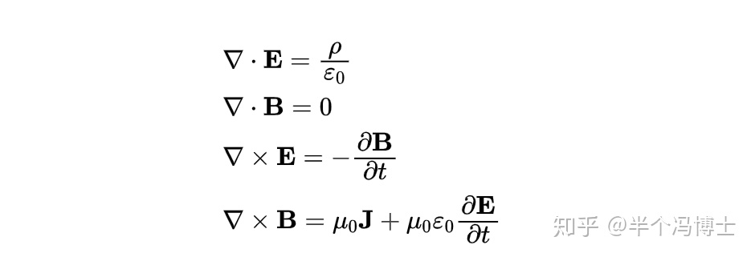

这么好看的一套公式是怎么打出来的呢？

在latex里面，可以用于显示方程组的命令其实很多。其中最简单的一种就是 array。

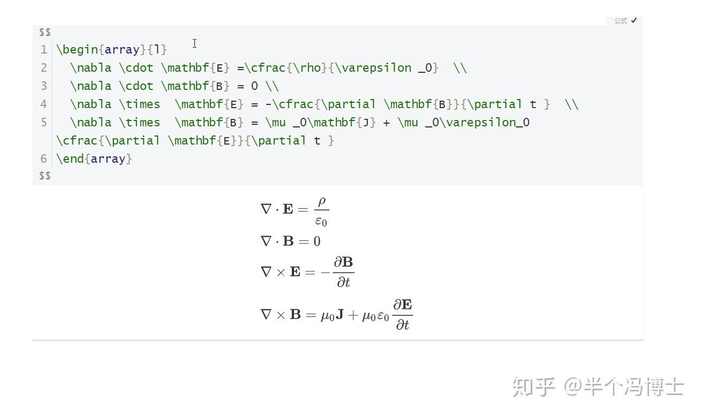

array这个命令的意思是“数组”或者“阵列”。在latex中我们常它来规范公式的排列方式。然而要完全理解这个命令，我们还是得回到[公式排列](https://www.zhihu.com/search?q=%E5%85%AC%E5%BC%8F%E6%8E%92%E5%88%97&search_source=Entity&hybrid_search_source=Entity&hybrid_search_extra=%7B%22sourceType%22%3A%22article%22%2C%22sourceId%22%3A266061200%7D)的基本规范来。


首先，我们要打出方程组的话，必须得要换行。而在latex中，直接输入enter键是没有用的。

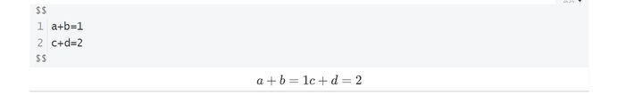

真正要实现换行，必须要用两个反斜杠：

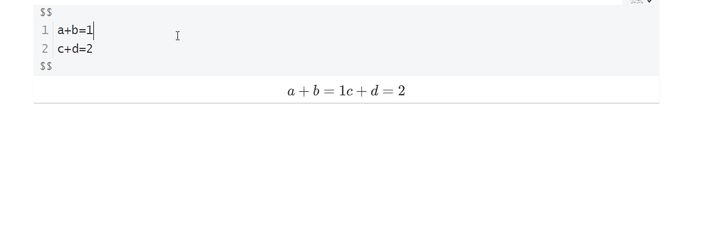

但在方程组中，我们还想要让每个方程都能对齐。那么此时就需要输入array环境了。这种关键需要用begin和end来完整描述一下。 从字面上也很容易理解，begin和end分别表示这个环境的开始和结束。那么放在begin和end中间的部分就表示它们都是array这个**阵列**中的内容。


在刚才的显示里面我们不难发现在{array}之后加入了一对空的花括号显示才变得正常。这是因为这个环境必须要搭配一个参数。这个参数表示我们这段内容的对齐方式。

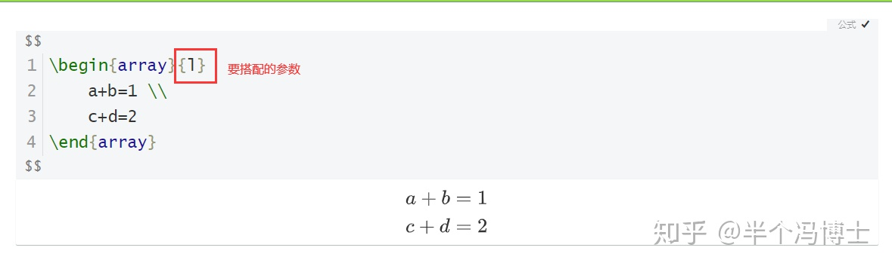

这个对齐方式就很简单了，l-代表left（[左对齐](https://www.zhihu.com/search?q=%E5%B7%A6%E5%AF%B9%E9%BD%90&search_source=Entity&hybrid_search_source=Entity&hybrid_search_extra=%7B%22sourceType%22%3A%22article%22%2C%22sourceId%22%3A266061200%7D)）、r-代表right([右对齐](https://www.zhihu.com/search?q=%E5%8F%B3%E5%AF%B9%E9%BD%90&search_source=Entity&hybrid_search_source=Entity&hybrid_search_extra=%7B%22sourceType%22%3A%22article%22%2C%22sourceId%22%3A266061200%7D)）、c-代表center([居中对齐](https://www.zhihu.com/search?q=%E5%B1%85%E4%B8%AD%E5%AF%B9%E9%BD%90&search_source=Entity&hybrid_search_source=Entity&hybrid_search_extra=%7B%22sourceType%22%3A%22article%22%2C%22sourceId%22%3A266061200%7D)）。而空花括号对应的是默认对齐方式--左对齐。

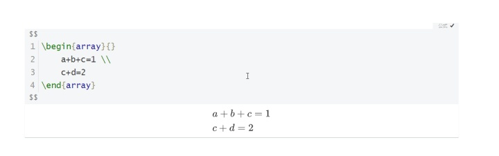

明白这一点过后就不难理解刚刚展示的麦克斯韦方程组的打法了--所有的方程都是左对齐。

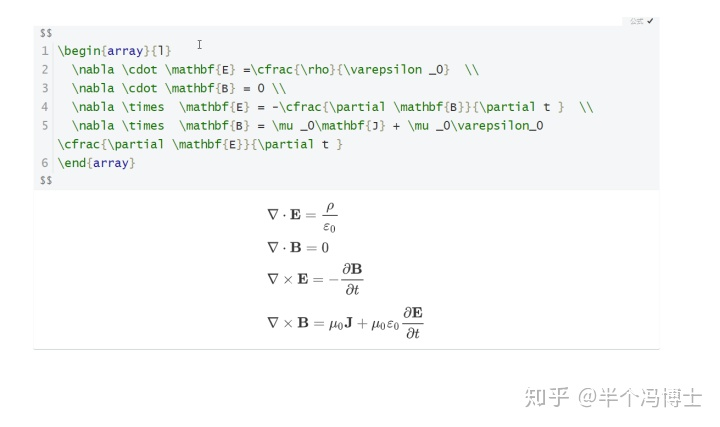

但细心的同学应该会感觉到：这个方程组的排版似乎还差点什么？没错，我们一般都是把等号全部对齐的，那么这又怎么办呢？


在latex里面，类似array这样的环境都是用&(and)符号来对“列”进行区分的。每一个&(and)符号表示间隔符，每行所有的&(and)符对应的内容全部对齐。这样我们所有的等号都全部上下对齐了。

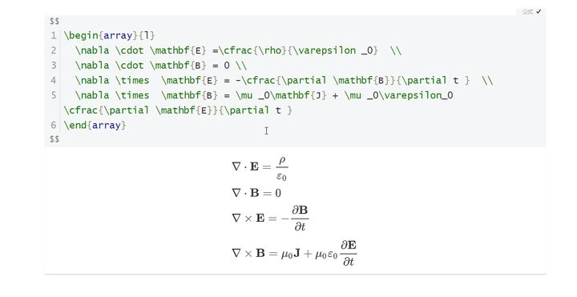

注意， 我们刚才的操作其实还有一点不是特别规范。那就是在{array}之后的{l}。这里&（and)符左右两边的内容各为一列，而{l}只表示一列的排列方式。

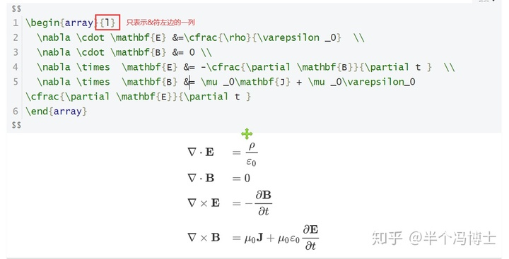

所以更为严谨的编码应该是写下两个ll。

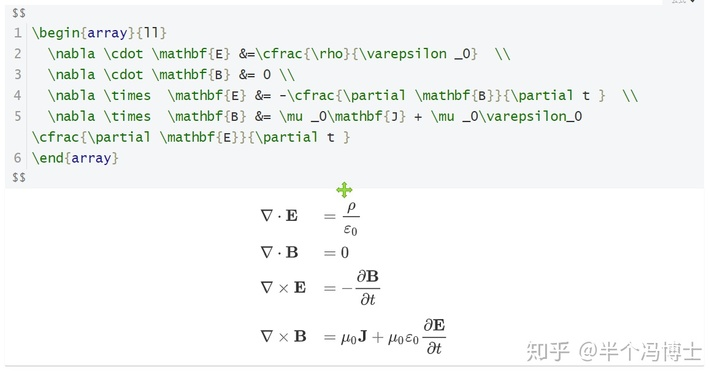

在latex中，类似“阵列”的命令还有很多，语法也都一样，比如align--排列、matrix--[矩阵](https://www.zhihu.com/search?q=%E7%9F%A9%E9%98%B5&search_source=Entity&hybrid_search_source=Entity&hybrid_search_extra=%7B%22sourceType%22%3A%22article%22%2C%22sourceId%22%3A266061200%7D)、eqarray等。不过要注意，这些环境通常都不需要指定居左还是居右，具体排出的样式也不尽相同。

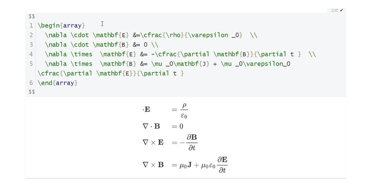

在各种写法当中，我们最为推荐的是align环境(也可以写成aligned）。它直接就表示“排列”，用它来排只有一个等号的方程组时它默认就是“&符号左右两端的内容向中间对齐”，非常漂亮。

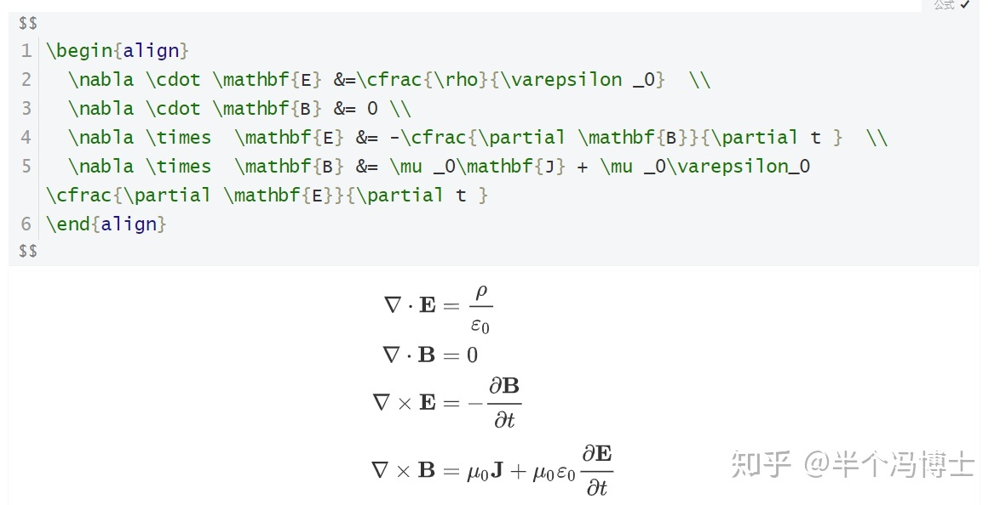

同时align环境还有一个特别棒的"备注"方法。也就是直接在公式结尾部分加入两个挨着的 && 符号就可以了，它不会影响整个排列的对齐方式，可以非常方便地加入备注内容。

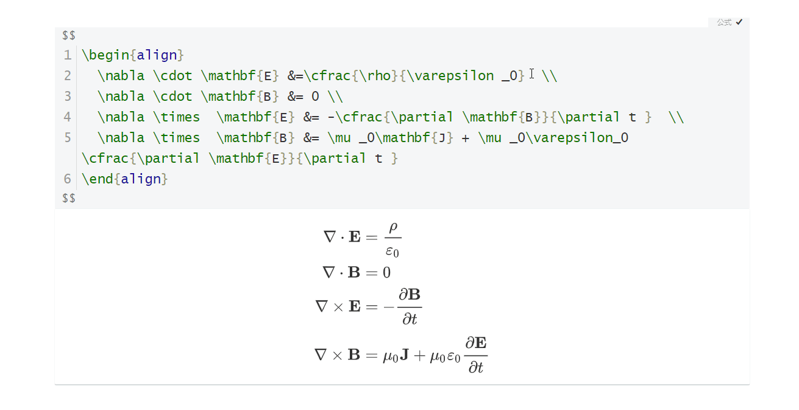

结合我们前面讲过的括号的使用方法，如果我们要想打出带左大括号的方程组，就直接在左边加入\\left\\{，右边由于没有括号，就直接写上\\right.就可以了。

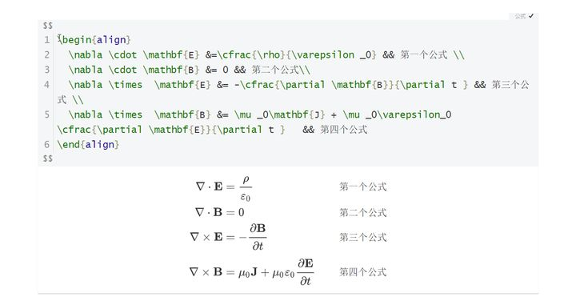

懂得了这种用法，大家自己来试一试，如果我想要打出这样一个参数程该怎么打呢？


又或者我们想打出这样一个分段函数，是不是也可以用类似的方法了呢？


```
f(x)=\left\{\begin{align}
  1,x>0\\
  0,x=0\\
  -1,x<0
\end{align}\right.
```

___

关注我们分享更多有趣有用的知识哟~

